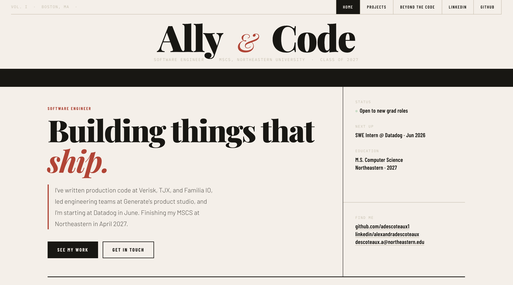
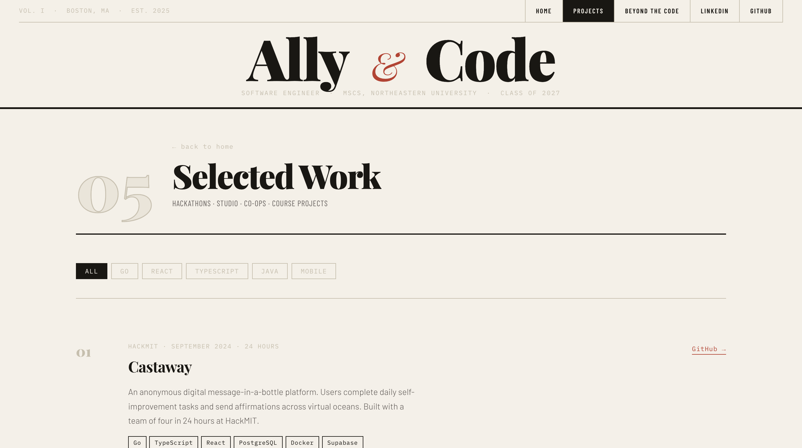
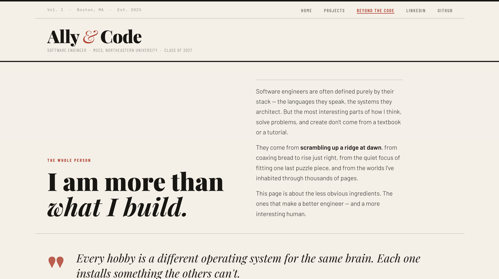

# Ally Descoteaux — Personal Homepage

**Author:** Ally Descoteaux
**Class:** CS5610 — Web Development
**License:** MIT
**Live site:** <https://ades-webdevproject1.netlify.app/>

---

## Project Objective

Personal homepage built with vanilla HTML5, CSS3, and ES6+ JavaScript modules.

---

## Screenshot





---

## Pages

| Page            | URL                   | Description                                                                                       |
| --------------- | --------------------- | ------------------------------------------------------------------------------------------------- |
| Home            | `index.html`          | Masthead, skills ticker, hero, about, experience table, featured projects, interactive terminal   |
| Projects        | `pages/projects.html` | Full project list with live tag filtering                                                         |
| Beyond the Code | `pages/hobbies.html`  | AI-generated essay on how hobbies (hiking, baking, puzzles, reading) shape engineering practice |

---

## Creative Feature

An **interactive terminal** in the "ask me anything" section on the homepage — visitors type commands to learn about me:

`about` · `skills` · `experience` · `projects` · `education` · `interests` · `contact` · `whoami` · `clear`

Easter eggs: `git log`, `git status`, `sudo`, `hire`, `coffee`, `ls`, `pwd`, `cd projects`, `date`

Arrow keys navigate command history. Built entirely in vanilla ES6 (`js/terminal.js`, ~190 lines, no libraries).

---

## Project Structure

```
ally-homepage/
├── index.html              # Home (masthead, ticker, hero, about, experience, projects, terminal)
├── pages/
│   ├── projects.html       # Project list with tag filtering
│   └── hobbies.html        # AI-generated "Beyond the Code"
├── css/
│   ├── styles.css          # Global design tokens & shared components
│   ├── home.css            # Home page layout
│   ├── projects.css        # Projects page layout
│   └── hobbies.css         # Hobbies page layout
├── js/
│   ├── main.js             # Home page entry (ES6 module)
│   ├── nav.js              # Mobile nav toggle
│   ├── timeline.js         # Staggered scroll-reveal for experience rows
│   ├── terminal.js         # Interactive terminal (creative feature)
│   └── projects.js         # Projects page entry + tag filter
├── images/
│   └── favicon.svg
├── eslint.config.js        # ESLint flat config (Prettier rules integrated)
├── package.json
├── package-lock.json
├── LICENSE
└── README.md
```

The skills ticker is CSS-only (`@keyframes ticker` in `css/home.css`) — no JS required.

---

## Setup

Requires Node 18+ and npm.

```bash
# Install dev dependencies
npm install

# Run locally
npm run dev          # live-server with auto-reload at http://localhost:3000
# or
npm start            # static serve at http://localhost:3000

# Lint + auto-format (ESLint + eslint-plugin-prettier in one pass)
npm run lint         # report issues
npm run format       # auto-fix issues
```

Formatting rules live inside `eslint.config.js` via `eslint-plugin-prettier`, so `eslint --fix` both lints and formats the JS. HTML and CSS are not auto-formatted — they're hand-maintained.

---

## Deployment

Deployed on **Netlify** with continuous deployment from the `main` branch — every push triggers a fresh build.

- **Live URL:** <https://ades-webdevproject1.netlify.app/>
- **Build command:** none (vanilla static files)
- **Publish directory:** repository root
- **Pretty URLs:** enabled (Netlify default) — `/pages/projects` resolves to `/pages/projects.html`

---

## GenAI Tools Used

**Model:** Claude Sonnet 4.6 (Anthropic)

**Used for:** Initial generation of the "Beyond the Code" page (`pages/hobbies.html` + `css/hobbies.css`) as required by the rubric. Content, copy, and formatting were then revised by me.

**Prompt (paraphrased):**

> Build a simple HTML page I can add to my personal website that shows how my different hobbies — hiking, baking, puzzles, reading — all impact who I am and my work as a software engineer. The page should illustrate how many different aspects of ourselves play a part in education/work success. Include a disclaimer that the page is AI-written. Match the rest of the site's styling: Playfair Display + Barlow + Barlow Condensed + IBM Plex Mono; paper/ink color palette (`--ink: #1a1713`, `--paper: #f5f0e8`, `--red: #c0392b`); 1160px max width; ruled-line section dividers.

The color and typography tokens passed in match the `:root` variables in `css/styles.css`, so the generated page inherits the same design system as the rest of the site.

---

## Rubric Checklist

- [x] ES6 modules (`type="module"` in HTML + `"type": "module"` in package.json)
- [x] No jQuery, no component libraries
- [x] CSS, JS, Images in separate folders
- [x] Meta: author, description, icon
- [x] Original JS feature >5 lines, no libraries (`js/terminal.js`, ~190 lines)
- [x] Prettier formatted (via `eslint-plugin-prettier`)
- [x] W3C compliant — validated at validator.w3.org
- [x] ESLint config present (flat config)
- [x] All images have alt attributes
- [x] 2+ HTML pages at different URLs (3 pages)
- [x] CSS classes used throughout
- [x] Semantic HTML only (no div-buttons etc.)
- [x] Clean CSS, no `!important`
- [x] Flexbox and CSS Grid used
- [x] MIT License
- [x] `package.json` with all dependencies
- [x] GenAI usage documented above
- [x] Deployed to a public URL
